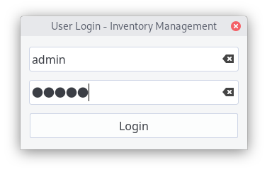
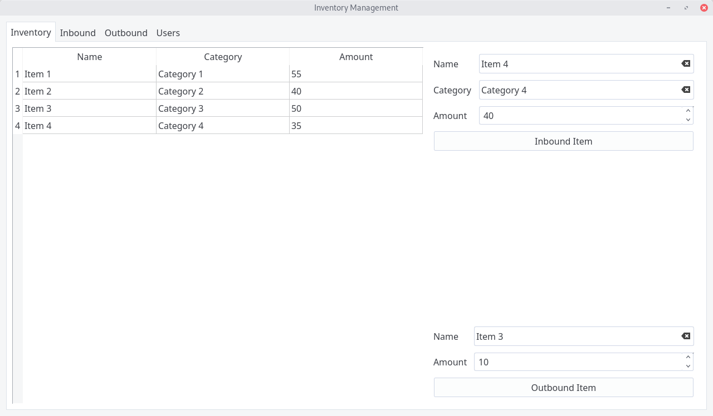
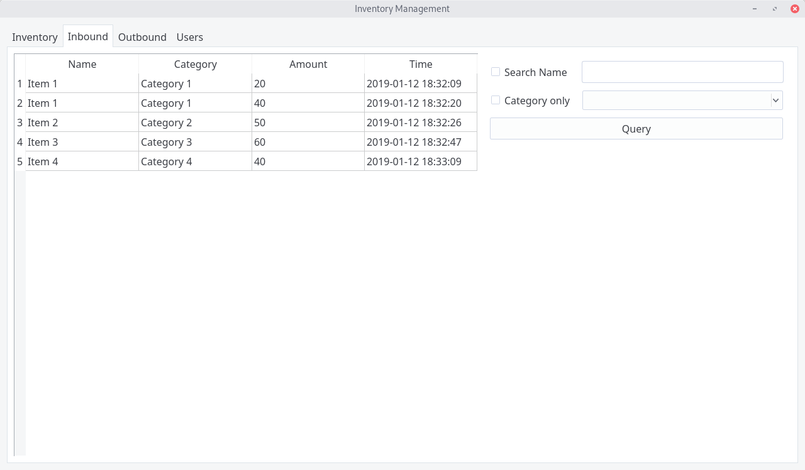
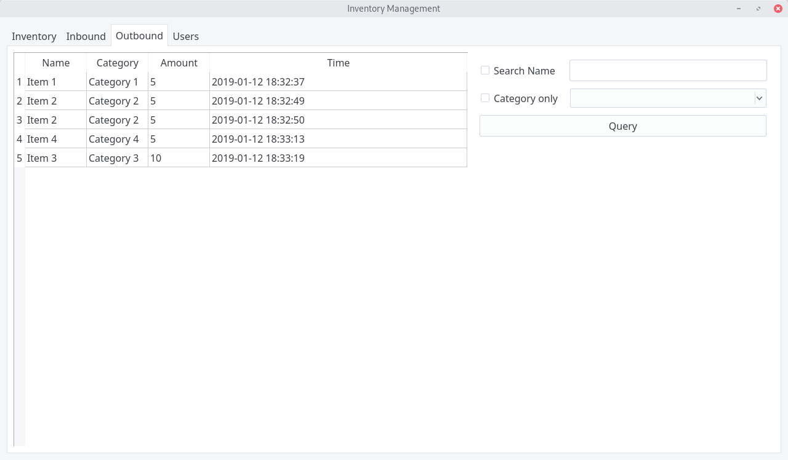
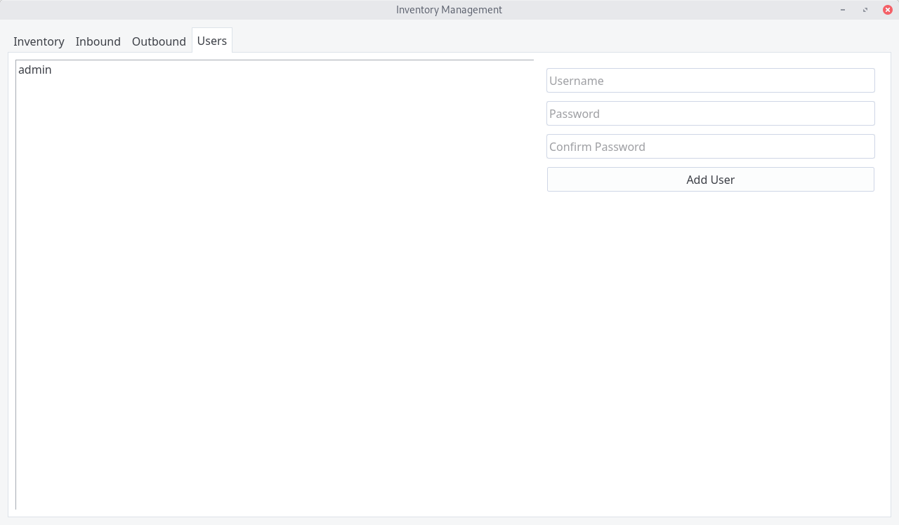
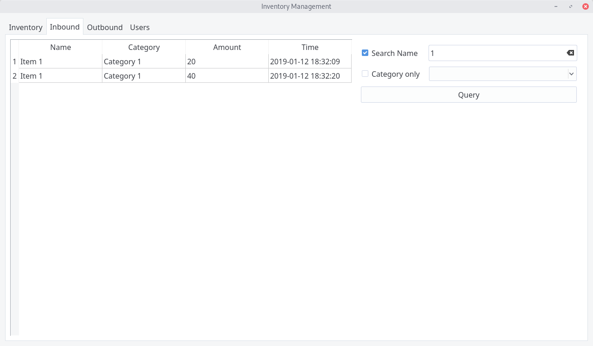
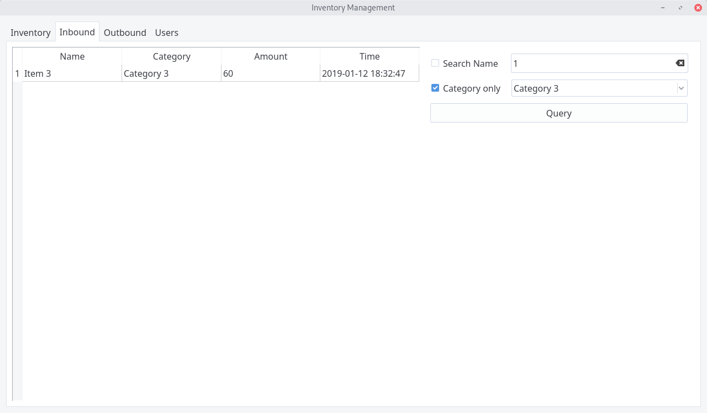

# Usage Sample 使用示例

> Debug Log 调试日志: [usage_sample_debug.log](usage_sample_debug.log)

## Login Dialog 登录对话框

Default username/password: `admin`

默认用户名/密码：`admin`

## Inventory Management Tab 库存管理标签页

In/outbound items and display inventory table. 入库/出库商品并显示库存表格。

## Inbound Log Query Tab 入库记录查询标签页

## Outbound Log Query Tab 出库记录查询标签页

## User Management Tab 用户管理标签页

## Inbound Log Query Sample#1 入库记录查询示例#1

Search by item name key word. 以商品名称关键词搜索。

## Inbound Log Query Sample#2 入库记录查询示例#2

Display certain category logs only. 仅显示某一分类的记录。

